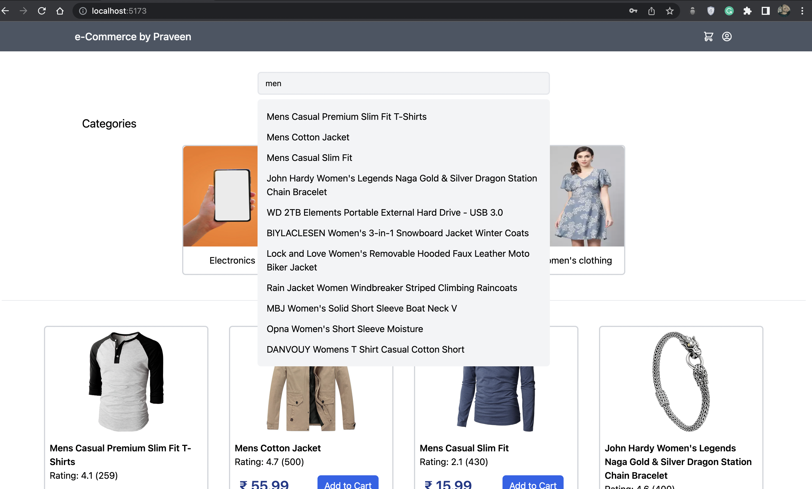
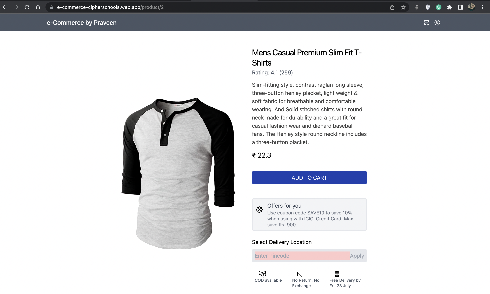
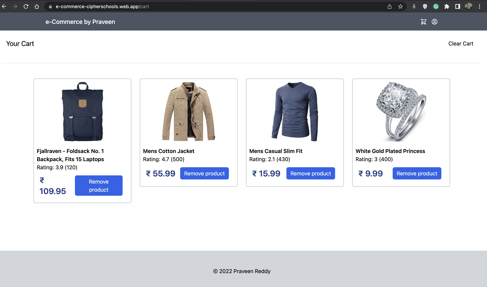

# E-Commerce by Praveen Reddy

## Screenshots







## Setup

Clone the repository from [GitHub](https://github.com/Boredgoie/e-commerce-cipherschools)

```bash
git clone https://github.com/Boredgoie/e-commerce-cipherschools.git
```

Move to the directory & install dependencies

```bash
cd e-commerce-cipherschools
yarn install
```

Run the application

```bash
yarn start
```


## Tech Stack

- [React.js](https://reactjs.org/) - Frontend Library
- [Vite](https://vitejs.dev/) - Build Tool 
- [Tailwind CSS](https://tailwindcss.com/) - CSS Framework
- [Firebase Hosting](https://firebase.google.com/) - Web hosting

## Features

- User Registration and Login
- User Profile
- User Cart
- Shopping Items


## License

This project is licensed under [MIT License](LICENSE).
